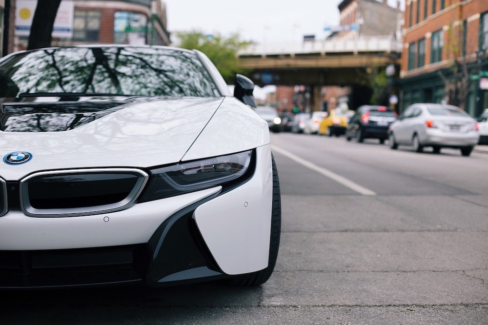

Internship in CRM Systems & eCRM at BMW in Munich from March until July 2018.

As part of the customer relationship management department, the CRM Systems and eCRM team focuses on optimizing the customer journey on the BMW.de website and other online customer touchpoints of the MINI and BMW brands. Important topics are the online car-configurator, the "need analyzer", prize competitions, newsletters and different mailing and social media campaigns.

##Tasks

- Developing, monitoring and optimizing online CRM campaigns
- Maintaining the www.BMW.de website and overseeing the rollout of different new features
- Finding new ways to improve the customer journey on the website
- Running constant tests on the website, especially the car-configurator
- Participation in the development of different E-Mail and Social Media campaigns
- Active participation in the development and optimization of the BMW "need analyzer" for the German market
- Implementation of the new GDPR guidelines on the different online touchpoints of BMW
